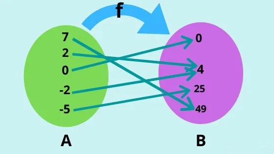

<head>
  <link rel="stylesheet" href="https://cdn.jsdelivr.net/npm/katex@0.15.1/dist/katex.css" integrity="sha384-WsHMgfkABRyG494OmuiNmkAOk8nhO1qE+Y6wns6v+EoNoTNxrWxYpl5ZYWFOLPCM" crossorigin="anonymous">
</head>

A definição matemática moderna de funções é feita por teoria de conjuntos. Um bom recurso para se aprofundar é o livro [Para Todo E](https://sites.google.com/usp.br/paratodoe). É um livro de **Análise Real** (uma área de estudo da matemática) bem mais aprofundado e avançado do que precisaremos para Cálculo 1. Mas fica a recomendação à todos que possuírem curiosidade. Na escrita desse texto eu vou evitar pedantismo matemáticos como "considere um conjunto não-degenerado" ou coisas do tipo. A não ser que seja dito o contrário, tudo deve funcionar seguindo a intuição.

## O conceito

Função, na matemática, é tudo aquilo que relaciona dois elementos de uma maneira específica.

> Uma função de $A$ em $B$ é uma regra que asssocia a cada elemento de $A$ um único elemento de $B$.

Vamos dissecar essa frase, ok?

O que é $A$ ? O que é $B$ ?

Aqui, $A$ e $B$ são conjuntos que possuem elementos.

Exemplos:

$A$ poderia ser um conjunto numérico como $A = \{1, 2, 3, 4, 5\}$ (o uso de colchetes é importante, ele indica que os elementos que estão dentro são partes de um conjunto).

E $B$ poderia ser outro conjunto **não necessariamente igual** como $B = \{2, 3, 4, 5, 6, 7\}$.

Eles podem ser literalmente de qualquer forma e de qualquer tamanho.

O que a frase nos diz?

Para **cada** elemento de $A$ é associado um **único** elemento de $B$.

Ou seja, não importa como você conectar os elementos, desde que você use **TODOS** os elementos de $A$ e que cada um deles esteja conectado a **apenas UM** elemento de $B$, tá valendo!

---

Uma maneira de pensar sobre funções é uma seta saindo de cada elemento de $A$ e chegando em elementos de $B$.

Chamamos essa função de $f$.

Costumamos falar também que $f$ leva elementos de $A$ em $B$.

Chamamos de $A$ domínio e $B$ contra-domínio.

Uma outra maneira de definiar $f$ seria:

$$f: A \rightarrow B$$

---

## Na prática

Na prática, em questões e no dia a dia você verá bastante o símbolo $\mathbb{R}$. Ele representa todos os números reais. O que ja estamos acostumados mesmo.

Então você verá bastante:

$$f: \mathbb{R} \rightarrow \mathbb{R}$$

Vale citar também outros simbolos que aparecem como:

$\mathbb{R}^+$ -- Todos os números reais não-negativos (inclui o zero).  
$\mathbb{R}^-$ -- Todos os números reais não-positivos (inclui o zero).

Alguns livros usam:  
$\mathbb{R}_*$ -- Todos os números reais exceto o zero.

---
Usaremos letras minúsculas como $y$ para representar elementos e letras maiusculas como $Y$ para represetnar conjuntos.

Então, ao escrever $y \in Y$

Siginifica $y$ (elemento) pertence a $Y$ (conjunto).

Considere agora:
$$f: X \rightarrow Y$$

Outra maneira de escrever é denotarmos que cada elemento de $Y$ é um elemento de $X$ aplicada uma função $f$ sobre ele:

$$y = f(x)$$

Uma maneira de pensar é: a $f$ levou o $x$ no $y$.

>**Curiosidade --** Essa notação atual de funções que utilizamos foi desenvolvida por Leunard Euler em 1743.

