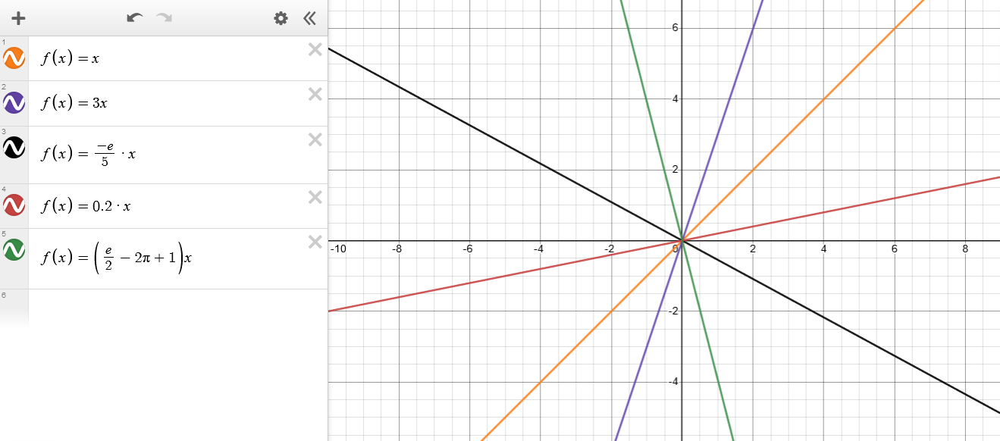

 <head>
  <link rel="stylesheet" href="https://cdn.jsdelivr.net/npm/katex@0.15.1/dist/katex.css" integrity="sha384-WsHMgfkABRyG494OmuiNmkAOk8nhO1qE+Y6wns6v+EoNoTNxrWxYpl5ZYWFOLPCM" crossorigin="anonymous">
</head>

De forma geral, as funções matemáticas desempenham um papel fundamental na compreensão e modelagem de diversas situações e fenômenos em diferentes áreas de estudo, como Engenharia, Matemática, Economia e Física. Portanto, iniciar o estudo desse ponto é indispensável para o entendimento, análise e aplicação de conceitos em diversos campos de conhecimento.

Sabendo sobre essa variedade, surge a pergunta: quantas funções existem? Imagina-se que existam infinitas funções, isso porque a matemática permite que funções sejam criadas continuamente para situações específicas.

No entanto, nosso foco aqui estará nas funções mais conhecidas e utilizadas na Engenharia, sendo elas as mais importantes neste início de curso.

As funções podem ser encaradas como uma conversa, vamos ver o que elas nos dizem.

Para visualizar as funções recomendamos um sites como [desmos](https://www.desmos.com/) ou [geogebra](https://www.geogebra.org/calculator), ambos são softwares muito potentes e recomendamos o uso deles para visualizar as funções.

#### Função Constante

Essas são as funções mais simples que existem.

Elas são da forma $f(x) = a,\  a \in \mathbb{R}$

Ela diz o seguinte, "Para cada $x$ que você me der eu retorno $a$"

Ela gera gráficos da seguinte forma:

Perceba que o $a$ pode ser qualquer número real, como na funcção mais abaixo, na função azul, têmos $a = \frac{e}{4} - 2 \cdot \pi + 1$.

Caso você não conheça o número $e$, não há problema!

Você aprenderá sobre ele durante o curso de Cálculo I, ele é um número super importante em varias aplicações matemáticas.

#### Função Linear

Funções lineares são da forma $f(x) = ax ,\  a \in \mathbb{R}, \text{ com } a \neq 0$ (pois se a = 0 caimos no caso anterior)

Assim como a de cima, aqui, para cada $x$ dado ela retorna $a$ vezes $x$.

Chamamos o $a$ de **coeficiente linear**.

Exemplos de funções lineares: 

Perceba que na função em laranja têmos $a = 1$.

#### Função Afim

Descreve uma relação de proporcionalidade constante entre duas variáveis  
Equação geral:$f(x) = ax + b,\ \  a, b \in \mathbb{R}, \text{ e com } a,b \neq 0$   

Exemplos:

Perceba que os gráficos são linhas retas, a inclinação é dado pelo coeficiente linear $a$ e o valor inicial ($f(0)$) é o valor de $b$

#### Função Quadrática

Equação geral: $f(x) = ax^2 + bx + c , \text{ e com } a \neq 0$

Os gráficos são chamados de parábolas, perceba como o valor de $a$ altera o gráfico.

Quando $a$ é negativo, o gráfico fica com a parábola para baixo.

Os coeficientes $b$ e $c$ afetam a posição no plano, $b$ a posição horizontal e $c$ a posição vertical 

#### Generalização: Função Polinomiais

Todas as funções que são da forma:

$p(x) = \sum\limits_{k=0}^{n} a_k x^k = a_{n}x^n + a_{n-1}x^{n-1} + a_{n-2}x^{n-2} + \dots + a_0, \ a_n \neq 0$

Essa é a generalização das funções que vimos até agora, todas as funções dessa forma.

"Resolver" uma equação polinomia significa encontras suas raízes, elas podem ou não existir no plano real ($\mathbb{R}$) mas as vezes elas só existem no plano complexo ($\mathbb{C}$), nós não veremos sobre o plano complexo em Cálculo I mas se você for de cursos como Engenharia Elétrica, saiba que ele será bem comum nos seus estudos.

#### Função Exponencial

Equação geral:  $f(x) = a \cdot b^x + c$ 

Chamamos $b$ de base da exponencial.

Os gráficos são assim:

Essas funções são extremamente importante para a modelagem de problemas reais é o principal motivo é a sua *derivada*.

Essa função também tem uma conexão especial com o número de euler, $e$.

Falaremos um pouco mais sobre isso na primeira aula.

#### Função Logarítmica

Essa é a inversa da função exponencial e ela é extremamente importante matemáticamente.

Muitas coisas relacionadas as funções exponenciais só existem na matemática por causa da função logaritmica.

Logarítmos também tiveram muita importância histórica no periodo das navegações por simplificar contas de multiplicações.

Equação geral: $f(x)=\log_b(x)$

Chamamos $b$ de base logaritmica

Uma característica interessante do logaritmo é que ele cresce **muito** lentamente.

#### Função Trigonométrica

Exemplos: $\sin(x), \cos(x), \tan(x)$

Os gráficos são periódicos.

Aqui temos funções limitadas que são interessantes também!

